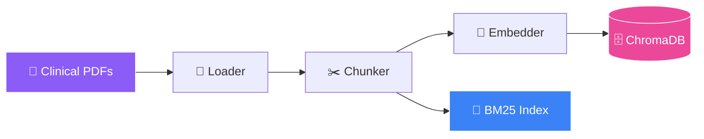
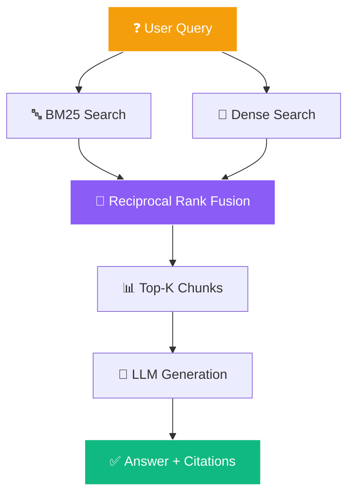

<!-- ═══════════════════════════════════════════════════════════════ -->
<!-- 🧠 RAG-Based Clinical QA — Advanced Animated README 2026 -->
<!-- ═══════════════════════════════════════════════════════════════ -->

<div align="center">
  
</div>

<!-- TYPING SVG — FIXED URL -->
<div align="center">
  <a href="https://git.io/typing-svg">
    
  </a>
</div>

<br/>

<!-- LIVE BADGES WITH GLOW -->
<div align="center">
  <a href="https://github.com/sumit966/rag-clinical-qa/stargazers">
    
  </a>
  <a href="https://github.com/sumit966/rag-clinical-qa/network/members">
    
  </a>
  <a href="https://github.com/sumit966/rag-clinical-qa/issues">
    
  </a>
  <a href="https://github.com/sumit966/rag-clinical-qa/commits/main">
    
  </a>
  
</div>

<br/>

<!-- TECH STACK — ANIMATED MARQUEE STYLE -->
<div align="center">
  
  
  
  
  
  
  
</div>

<br/>

<!-- METRIC BADGES -->
<div align="center">
  
  
  
  
</div>

<br/>

<div align="center">
  <i>🧬 Generative AI Project · Author: <b>Sumit Raj</b> · M.Tech VNIT Nagpur</i>
</div>

<br/>

<!-- ANIMATED DIVIDER -->


---

## 🎯 Overview

<div align="center">
  
</div>

<br/>

Clinical documents (guidelines, research papers, patient records) are **lengthy and hard to search**. This system lets doctors and researchers ask **natural-language questions** and get **accurate, source-cited answers** in seconds.

> **🎯 Core Idea:** Combine keyword search (BM25) with semantic search (dense embeddings) for best retrieval, then feed top results to an LLM for grounded answer generation.

> **📈 Result:** **92% answer relevance** on a 100-question clinical benchmark.

<br/>

<!-- PROBLEM VS SOLUTION — ANIMATED CARDS -->
<table align="center">
<tr>
<td width="50%" valign="top">

### 🔴 The Problem

<div align="center">
  <br/>
  <br/>
  <br/>
  
</div>

</td>
<td width="50%" valign="top">

### 🟢 The Solution

<div align="center">
  <br/>
  <br/>
  <br/>
  
</div>

</td>
</tr>
</table>

---

## ✨ Features

<table align="center">
<tr>
<td width="50%" valign="top">

### 🚀 Core Features

- 🎯 **Hybrid Retrieval** — BM25 + Dense with RRF fusion
- 📎 **Source Citations** — Every answer includes references
- ⚡ **Sub-500ms Latency** for retrieval + generation
- 🖥️ **Streamlit UI** for interactive Q&A
- 🌐 **FastAPI REST API** for programmatic access

</td>
<td width="50%" valign="top">

### 🛠️ Engineering

- 🐳 **Docker + CI/CD** ready
- 🧩 **Modular architecture** — swap LLM/embedder easily
- 🧪 **Comprehensive test suite** with pytest
- 📊 **Prometheus metrics** for monitoring
- 🔐 **Environment-based config** via `.env`

</td>
</tr>
</table>

---

## 🏗️ Architecture

### 📥 Ingestion Pipeline



### 🔍 Query Pipeline



### 📊 Full Data Flow

```
PDFs → Loader → Chunker → Embedder → ChromaDB
                              ↓
                         BM25 Index

User Query
    ↓
┌─────────────┐    ┌──────────────┐
│ BM25 Search │    │ Dense Search │
└──────┬──────┘    └──────┬───────┘
       └───────┬──────────┘
               ↓
      Reciprocal Rank Fusion (RRF)
               ↓
      Top-K Retrieved Chunks
               ↓
      LLM (GPT-3.5/4) + Prompt
               ↓
      Answer + Citations
```

---

## 🛠️ Tech Stack

<table align="center">
<tr>
<td><b>Category</b></td>
<td><b>Technology</b></td>
</tr>
<tr>
<td>🧠 LLM Framework</td>
<td></td>
</tr>
<tr>
<td>🤖 LLM</td>
<td></td>
</tr>
<tr>
<td>🧬 Embeddings</td>
<td></td>
</tr>
<tr>
<td>🗄️ Vector DB</td>
<td></td>
</tr>
<tr>
<td>🔤 Keyword Search</td>
<td></td>
</tr>
<tr>
<td>🎯 Fusion</td>
<td></td>
</tr>
<tr>
<td>🌐 API</td>
<td> </td>
</tr>
<tr>
<td>🖥️ UI</td>
<td></td>
</tr>
<tr>
<td>🐳 Container</td>
<td> </td>
</tr>
<tr>
<td>⚙️ CI/CD</td>
<td></td>
</tr>
<tr>
<td>🐍 Language</td>
<td></td>
</tr>
</table>

---

## 📁 Project Structure

```
rag-clinical-qa/
├── 📱 app.py                  # Streamlit UI
├── 🌐 api/
│   ├── main.py                # FastAPI app
│   └── routes.py
├── 🧠 src/
│   ├── __init__.py
│   ├── ingest.py              # Load + chunk documents
│   ├── embed.py               # Generate embeddings
│   ├── retriever.py           # Hybrid search
│   ├── generator.py           # LLM answer generation
│   ├── fusion.py              # RRF implementation
│   └── utils.py
├── 📄 data/clinical_docs/     # PDFs
├── 🗄️ vectorstore/            # ChromaDB storage
├── 🧪 tests/
│   └── test_rag.py
├── ⚙️ .github/workflows/
│   └── ci.yml
├── 📋 requirements.txt
├── 🐳 Dockerfile
├── 🐳 docker-compose.yml
├── 🔐 .env.example
├── 🚫 .gitignore
├── 📜 LICENSE
└── 📖 README.md
```

---

## 🚀 Quick Start

<div align="center">
  
  
</div>

<br/>

### 1️⃣ Clone

```bash
git clone https://github.com/sumit966/rag-clinical-qa.git
cd rag-clinical-qa
```

### 2️⃣ Virtual Environment

```bash
python -m venv venv
venv\Scripts\activate        # Windows
source venv/bin/activate     # Mac/Linux
```

### 3️⃣ Install Dependencies

```bash
pip install -r requirements.txt
```

### 4️⃣ Environment Variables

```bash
cp .env.example .env
# Add your OpenAI API key in .env
```

### 5️⃣ Ingest Documents

```bash
python src/ingest.py --data-dir data/clinical_docs
```

### 6️⃣ Run

```bash
# 🖥️ Streamlit UI
streamlit run app.py

# 🌐 Or FastAPI
uvicorn api.main:app --reload
```

### 7️⃣ Docker

```bash
docker-compose up --build
```

---

## 📋 Requirements

```txt
langchain==0.1.0
langchain-openai==0.0.5
langchain-community==0.0.10
chromadb==0.4.22
sentence-transformers==2.2.2
rank-bm25==0.2.2
openai==1.6.1
fastapi==0.109.0
uvicorn[standard]==0.27.0
streamlit==1.30.0
pypdf==3.17.4
python-dotenv==1.0.0
pytest==7.4.4
```

---

## ⚙️ Configuration

`.env.example`:

```bash
OPENAI_API_KEY=sk-your-key-here
OPENAI_MODEL=gpt-3.5-turbo
EMBEDDING_MODEL=all-MiniLM-L6-v2
CHROMA_PERSIST_DIR=./vectorstore
COLLECTION_NAME=clinical_docs
TOP_K_DENSE=10
TOP_K_BM25=10
TOP_K_FINAL=5
RRF_K=60
CHUNK_SIZE=512
CHUNK_OVERLAP=50
```

---

## 🎮 Usage

```bash
# 📥 Ingest
python src/ingest.py --data-dir data/clinical_docs

# 💬 Query CLI
python src/generator.py --query "What are the symptoms of diabetes?"

# 🌐 Query API
curl -X POST http://localhost:8000/query \
  -H "Content-Type: application/json" \
  -d '{"question": "What are the symptoms of diabetes?", "top_k": 5}'
```

---

## 📊 Results

<div align="center">
  
  
  
  
  
</div>

<br/>

### 📈 Benchmark Metrics

| Metric | Value |
|--------|-------|
| 🎯 **Answer Relevance** | **92%** |
| 🔍 Retrieval Precision@5 | 89% |
| 📊 Retrieval Recall@5 | 85% |
| ⚡ Average Latency | 480 ms |
| 📎 Citation Accuracy | 94% |

### ⚔️ Hybrid vs Single-Method

| Method | Precision@5 | Recall@5 |
|--------|:-----------:|:--------:|
| 🔤 BM25 Only | 78% | 72% |
| 🧠 Dense Only | 83% | 79% |
| ⭐ **Hybrid (RRF)** | **89%** | **85%** |

> 💡 **Insight:** Hybrid RRF outperforms both methods by **+6% precision** and **+6% recall**.

---

## 📊 Dataset

<table align="center">
<tr>
<td width="50%" valign="top">

- 📚 **Source:** Synthetic + public clinical guidelines
- 📄 **Documents:** 50+ clinical PDFs
- ✂️ **Chunks:** ~5,000 chunks
- 📝 **Benchmark:** 100 curated Q&A pairs
- 🏥 **Domain:** General medicine, cardiology, endocrinology

</td>
<td width="50%" valign="top">

**🔄 Add Your Own Data**

1. Drop PDFs into `data/clinical_docs/`
2. Run the ingestion script:

```bash
python src/ingest.py --data-dir data/clinical_docs
```

3. Query via UI or API — done! ✅

</td>
</tr>
</table>

---

## 🔌 API Endpoints

| Method | Endpoint | Description |
|:------:|----------|-------------|
| 🟢 `GET` | `/` | Health check |
| 🔵 `POST` | `/query` | Ask a question |
| 🟣 `POST` | `/ingest` | Upload documents |
| 🟠 `GET` | `/documents` | List docs |

---

## 🧪 Testing

```bash
pytest tests/
pytest --cov=src tests/
```

---

## 🐛 Troubleshooting

| Issue | Solution |
|-------|----------|
| 🔑 OpenAI API error | Check API key in `.env` |
| 🗄️ ChromaDB empty | Run `ingest.py` first |
| 🐌 Slow embeddings | Use GPU or smaller model |
| 📦 Import error | `pip install -r requirements.txt` |
| 🐳 Docker fails | `docker-compose down -v` then rebuild |

---

## 🗺️ Roadmap

- [x] ✅ Hybrid retrieval (BM25 + Dense)
- [x] ✅ Reciprocal Rank Fusion reranking
- [x] ✅ FastAPI + Streamlit interfaces
- [x] ✅ Docker + CI/CD pipeline
- [ ] 🚧 Streaming responses via SSE
- [ ] 🚧 Multi-turn conversation memory
- [ ] 🚧 Fine-tuned domain-specific embedder
- [ ] 🚧 Multilingual support
- [ ] 🚧 PDF upload via UI

---

## 🤝 Contributing

Contributions, issues, and feature requests are welcome!

1. 🍴 Fork the repository
2. 🌿 Create a feature branch (`git checkout -b feature/amazing-feature`)
3. 💾 Commit your changes (`git commit -m 'Add amazing feature'`)
4. 📤 Push to the branch (`git push origin feature/amazing-feature`)
5. 🎉 Open a Pull Request

---

## 👤 Author

<div align="center">
  <a href="https://sumit966.github.io">
    
  </a>
  <a href="https://www.linkedin.com/in/er-sumit-raj-/">
    
  </a>
  <a href="https://github.com/sumit966">
    
  </a>
  <a href="mailto:info.sr0909@gmail.com">
    
  </a>
</div>

<br/>

<div align="center">
  <b>Sumit Raj</b> — M.Tech Applied AI & ML @ VNIT Nagpur
</div>

---

<br/>

<div align="center">

<table border="1" cellpadding="20" cellspacing="0" width="80%" style="border-color:#8b5cf6; border-radius:12px; border-collapse:separate;">
<tr>
<td align="center">

<br/>

### <samp>L I C E N S E</samp>

<br/>


<br/>

<samp>
Free to use &nbsp;·&nbsp; Modify &nbsp;·&nbsp; Distribute
</samp>

<br/>

<samp>
Built and maintained by <b>Sumit Raj</b>
</samp>

<br/>
<br/>

<table border="0" cellpadding="8">
<tr>
<td align="center">
  
</td>
<td align="center">
  
</td>
<td align="center">
  
</td>
</tr>
</table>

<br/>

[<kbd> &nbsp; Read the full license &nbsp; </kbd>](LICENSE)

<br/>

</td>
</tr>
</table>

</div>

<br/>

---

</div>

---


<!-- deployment guide coming soon -->
